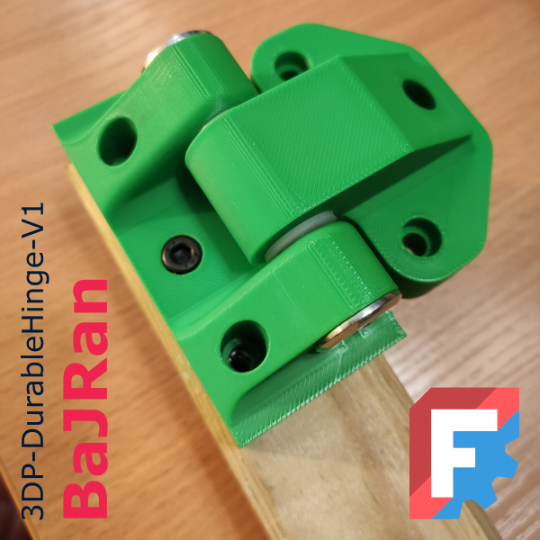

<!-- Begin README -->


<p align="center">
    <font size="5"><b>3DP-DurableHinge-V1</b></font><br>
    <font size="4">Durable hinge with enhanced steel components</font>
</p>

<div align="center">
    
</div>
<br>
<p align="center">
    <a href="https://daringfireball.net/projects/markdown/"></a>
    <a href="https://github.com/bajraan"></a>
    <a href="mailto:bajran1616@gmail.com"></a>
    <br>
</p>

> [!IMPORTANT]
>**This model requires additional parts. If you are unable to obtain them, you will not be able to reproduce it properly. Please refer to the list below for the required components needed for this creation.**

> [!NOTE]
>```markdown
>| nr | Part name                 | cnt | Comment             |
>|----|---------------------------|-----|---------------------|
>| 1  | Printed part A            | x 1 |                     |
>| 2  | Printed part B            | x 1 |                     |
>| 3  | Ericsson flat head nut M8 | x 2 | wood furniture Part |
>| 4  | Wood insert nut M5x12     | x 7 | wood furniture Part |
>| 5  | Screw DIN912 M5x20        | x 7 | Regular steel Part  |
>| 6  | Steel threaded rod M8X55  | x 1 | Regular steel Part  |
>| 7  | Nylon washer M8x2         | x 2 | Regular steel Part  |
>```
> <div align="center">
>     
> </div>

> [!NOTE]
> it is possible to replace parts 3 and 4 with pan head screw.
> e.g. 25mm Pan Head Pocket Hole Screws - 5201 Milescraft

> [!NOTE]
> <div align="center">
>     
> </div>

> [!NOTE]
> <div align="center">
>     
> </div>

<div align="center">
    
    

</div>

<!-- End README -->